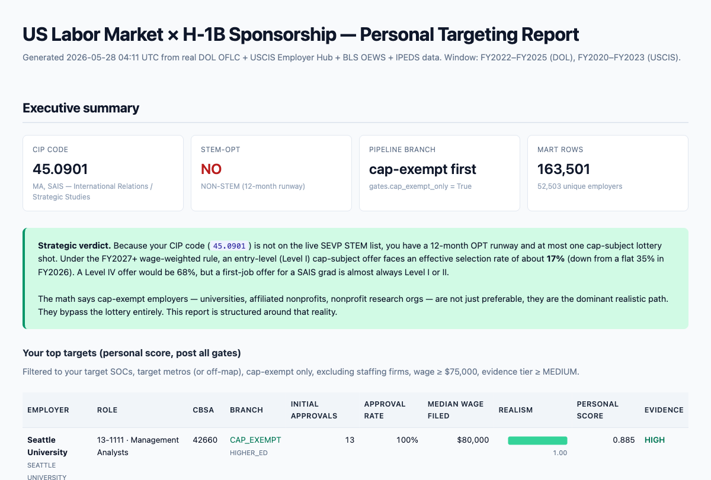

# US Labor Market × H-1B Sponsorship Map



A reproducible, citation-driven data pipeline that maps US labor-market demand
against employer H-1B sponsorship behavior. It turns DOL LCA, USCIS approvals,
BLS / OEWS, IPEDS, IRS, and SEC filings into an auditable, ranked view of which
employers realistically sponsor which roles in which metros. Every numeric rule
is traced to a Federal Register / CFR citation with a verified-at date. The full
specification lives in `labor_market_h1b_map_blueprint.md`; this README covers operation.

**Status:** ran end to end on real, multi-GB federal releases (Phase 0 source
verification 2026-05-27). Data validation is the loud-failing per-FY column mapper
in `ingest_dol.py` (it halts with the exact missing logical column when a source
schema drifts), not a formal schema validator.

> **Phase 0 was run autonomously on 2026-05-27.** All findings (live source
> URLs, current rule values, regime-change accounting) are in
> `data/manifest/phase0_findings.md`. Re-run on every quarterly rebuild.

---

## What this pipeline answers

1. **Which employers sponsor people like me, realistically?**
   Not raw LCA volume — LCA filings overstate hiring badly. We deflate by
   USCIS Initial Approvals (the headline "new sponsorship" signal) and, for
   cap-subject employers, by **wage-level-weighted lottery probability**
   (the FY2027+ regime: Level IV = 4 lottery entries, Level I = 1).
2. **Which cap-exempt employers should I target?**
   Cap-exempt (universities, affiliated nonprofits, nonprofit research orgs,
   gov't research) bypass the lottery entirely. For non-STEM-CIP applicants
   this is the dominant realistic path; the pipeline surfaces it as a
   first-class output.
3. **Where do my target SOCs × metros actually have sponsorship demand?**
4. **Which employers should I AVOID?** (Body shops, low-approval-rate mills,
   recent WARN-Act layoffs.)

---

## Quick start

```powershell
# 1. Install pinned dependencies (uses uv; pinned to Python 3.11)
uv sync --extra dev

# 2. Sanity-check the environment
uv run python -c "import polars, duckdb, rapidfuzz; print('env ok')"

# 3. See the Phase 0 branch decision (CIP-driven; non-STEM by default)
uv run python run.py --stage verify

# 4. Inspect / edit your profile, then re-verify
notepad user_profile.yaml
uv run python run.py --stage verify

# 5. Dry-run the full pipeline (no downloads, no transforms)
uv run python run.py --dry-run

# 6. Full run (downloads multi-GB DOL + USCIS files; allow time)
uv run python run.py

# 7. Re-run next quarter, skipping unchanged sources
uv run python run.py --incremental

# 8. Tests
uv run pytest -q
```

---

## Phase 0 branch decision (CRITICAL)

The pipeline reads `user_profile.yaml`'s `identity.cip_code` and checks it
against the live DHS STEM-Designated Degree Program List (cached in
`data/raw/sevp/stem_cip_list_2024-07-23.md`). The branch determines whether
you have one cap shot (non-STEM, 12-month OPT) or three (STEM, 36-month OPT
total) and therefore whether `cap_exempt_only` defaults to TRUE.

**SAIS-relevant CIP codes:**

| CIP | Field | STEM? |
|---|---|---|
| **45.0603** | Econometrics and Quantitative Economics | YES |
| **30.4901** | Mathematical Economics | YES |
| **30.7001** | Data Science | YES |
| 45.0601 | Economics, General | NO |
| 45.0605 | International Economics | NO |
| 45.0901 | International Relations (default) | NO |
| 45.0902 | National Security Policy Studies | NO |

If your conferred degree CIP isn't 45.0901, update `user_profile.yaml` and
re-run `python run.py --stage verify` to see the new branch.

---

## Architecture

```
data/raw          # untouched downloads, dated; sha256/ETag tracked
data/staging      # cleaned, typed, SOC/NAICS/CBSA standardized parquet
data/marts        # final joined fact table + 8 output views (parquet + csv)
data/manifest     # phase0_findings.md, sources.json, employer review CSVs
src               # ingest_*, entity_resolve, geo_normalize, join, scoring, views
tests             # offline fixture-driven unit + smoke tests
config.yaml       # pipeline-level rule values (dated + sourced)
user_profile.yaml # your CIP, SOC weights, metros, cap-exempt list, gates
run.py            # orchestrator
Makefile          # convenience targets
```

### Source modules

| Module | Source | Notes |
|---|---|---|
| `ingest_dol.py` | DOL OFLC LCA + PERM xlsx | Per-FY column mapper; fails loudly on missing required column |
| `ingest_uscis.py` | USCIS H-1B Employer Data Hub | Splits Initial vs Continuing approvals/denials |
| `ingest_bls.py` | BLS API v2 + OEWS metro zip | OEWS suppression preserved as NULL |
| `ingest_warn.py` | State WARN portals (NY/MA/VA/DC + skeletons) | Best-effort scrape; logs failures |
| `ingest_irs.py` | ProPublica Nonprofit Explorer | Cap-exempt subcategory evidence |
| `ingest_edgar.py` | SEC EDGAR company_tickers.json | Public-company parent CIK |
| `ingest_ipeds.py` | DOE DAPIP institution list | HIGHER_ED HIGH-confidence flag |
| `ingest_census.py` | OMB CBSA delineation 2023 | Geographic normalization |

### Transform / scoring

| Module | Responsibility |
|---|---|
| `entity_resolve.py` | Tiered employer-name resolver (normalize → exact → token-sort ≥ 95 → review → corporate-group overrides) |
| `geo_normalize.py` | City/state → CBSA code (with curated DC-metro shortcuts) |
| `cap_exempt.py` | Subcategory + confidence per 8 CFR 214.2(h)(19)(iii)(C) |
| `join.py` | DuckDB join of LCA / USCIS / OEWS into `mart_fact.parquet` |
| `scoring.py` | Bifurcated cap-exempt vs cap-subject realism + personal score |
| `views.py` | The 8 output views |

---

## The 8 output views (`data/marts/*.parquet` + `.csv`)

1. **`ranked_employers_capexempt`** — Cap-exempt sponsors sorted by realism.
2. **`ranked_employers_capsubject`** — Cap-subject sponsors sorted by realism (factors lottery weighting).
3. **`metro_heatmap`** — CBSA × SOC sponsorship volume and demand.
4. **`role_trends`** — SOC trends pre/post-2024 regime split.
5. **`cap_exempt_targets`** — The no-lottery lane by subcategory.
6. **`red_flags`** — High LCA volume + low approval rate / staffing / Level 1 mills.
7. **`green_card_friendly_employers`** — Ranked by PERM filings (when ingested).
8. **`personal_top_targets`** — Personal-score-weighted, filtered by your gates.
9. **`timing_calendar`** — Operational outreach windows per employer.

(Headline ranking is `ranked_employers_*` / `personal_top_targets`; both
respect `gates.min_evidence_tier` so tiny-sample employers never reach the
top by accident.)

---

## How sponsorship realism is computed

**Cap-exempt (no lottery):**
```
realism_capex = initial_approval_rate
              × min(1.0, initial_approvals / n_threshold_capexempt)   # default n=3
              × (1 - staffing_penalty)
              × (1 - layoff_penalty)
```

**Cap-subject (lottery applies, FY2027+ wage-weighted):**
```
realism_capsub = initial_approval_rate
              × Σ pct_level_L × lottery_rate_level_L            # FY2027 weighted
              × min(1.0, initial_approvals / n_threshold_capsubject) # default n=10
              × (1 - staffing_penalty)
              × (1 - layoff_penalty)
```

The wage-level adjusted selection rates (effective FY2027 onwards) live in
`config.yaml > rules.wage_level_adjusted_selection_rate_fy2027`:

| Level | Lottery entries | Approx selection rate |
|---|---|---|
| I | 1 | 17% |
| II | 2 | 34% |
| III | 3 | 51% |
| IV | 4 | 68% |

(Assumes the historical Level mix; recomputed from real DOL data each quarterly run.)

---

## Re-running each quarter

1. `git pull` (if tracked) to get any blueprint updates.
2. Re-run **Phase 0** to refresh source URLs + rule values:
   ```
   uv run python run.py --stage verify
   ```
   Read `data/manifest/phase0_findings.md` and update `config.yaml`
   citations for anything that's changed.
3. Re-run the full pipeline incrementally:
   ```
   uv run python run.py --incremental
   ```
4. Review queues to clear (a few minutes each):
   - `data/manifest/employer_matches_review.csv` — new fuzzy matches
   - `data/manifest/geo_review.csv` — new unmatched localities
   - `data/manifest/cap_exempt_review.csv` — MANUAL_REVIEW cap-exempt orgs

---

## When DOL changes schema

`ingest_dol.py` builds a per-FY column mapper from real headers. When DOL
adds/removes columns:

1. Pipeline fails loudly with the missing logical column name + the headers
   it actually saw.
2. Add the new physical-header pattern to `LOGICAL_COLUMNS` in
   `src/ingest_dol.py`.
3. Re-run.

The per-FY mappers are committed to `data/manifest/dol_column_mappers/` so
the history is auditable.

---

## Known limitations

- **Real-time demand**: no Lightcast/Revelio access in this build. Demand is
  modeled from BLS (which lags 1–6 months). Forward-looking claims carry
  data-lag labels per `accuracy_guardrails`.
- **WARN coverage**: only NY/MA/VA/DC have working scrapers in this build.
  CA/TX/WA/NJ/IL/FL/GA portals are JS-heavy and need per-state Playwright
  scrapers (TODO). Falls back to no-data; pipeline doesn't break.
- **PERM downstream usage**: `ingest_dol.py` can ingest PERM files but the
  join currently surfaces LCA only. PERM ranking view emits an empty file
  until the PERM stage is wired into the join.
- **Single-employer subsidiary chains**: the corporate-groups override file
  covers the FAANG / consultancy / big-bank tier. Long-tail subsidiaries
  flow through token-sort and may need manual review entries.

---

## License / data terms

Code: MIT (see `LICENSE`). Data: all primary data sources are US government public-domain releases. WARN
notices, IPEDS, and SEC EDGAR carry no usage restrictions. ProPublica
Nonprofit Explorer requires polite User-Agent (set
`PROPUBLICA_CONTACT_EMAIL` in `.env`). BLS API requires a free registration
key (set `BLS_API_KEY` in `.env`).
